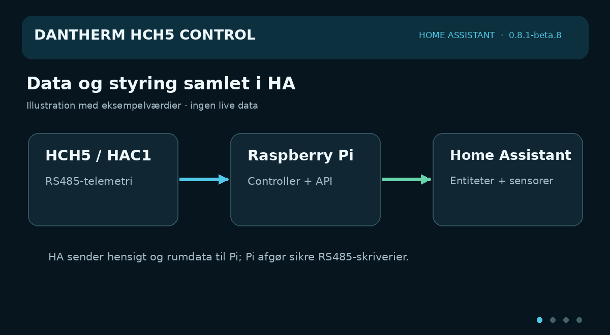

# Dantherm HCH5 Control




*Animated feature illustration using example values; it is not a screenshot of a live Home Assistant installation.*

An unofficial Home Assistant integration for a Dantherm HCH5 MK1 with HAC1. Its classic listening data path remains read-only and decodes internal Modbus RTU traffic without transmitting. The optional Raspberry Pi controller connection sends only high-level intent and room observations to the separate Raspberry Pi controller HTTP API; Home Assistant never writes Modbus/RS485 directly.

**Current published version: 0.8.1-beta.10.** It brings the HCH5's measurements into Home Assistant and, with the separate Pi controller, adds fan modes, OFF, Quick Boost, afterheat, Smart Auto rooms, sensor forwarding and air balancing. See the [complete feature list](docs/FEATURES.md), [entity reference](docs/entities.da.md) and [HACS installation](#installation-with-hacs).

> **Unofficial community project:** This software was not developed, supplied, commissioned, approved, certified or supported by Dantherm Group. Dantherm Group is not affiliated with this project. “Dantherm” is used only to identify compatible equipment; all trademarks belong to their respective owners. For product service and safety questions, contact Dantherm or an authorised installer.

## Safety model

The integration supports a raw TCP stream or a USB-RS485 adapter connected directly to the Home Assistant host. Both modes **only receive bytes** and contain no Modbus request generator or serial write call. Configure the serial side as `19200 8E1`. For Ethernet adapters, disable polling, Modbus TCP conversion, MQTT and any heartbeat or registration data sent over the serial port.

For direct USB use, select **USB-RS485** during setup and enter a stable path such as `/dev/serial/by-id/...`. Home Assistant must have permission to access that device, and no other process may open the same serial port.

Do not use an M-Bus gateway. M-Bus is electrically incompatible with RS485.

### Optional Raspberry Pi controller

Version `0.8.1-beta.10` connects to the controller API of [HCH5 Control](https://github.com/MRDonnii/dantherm-hch5-control). Current stable Pi version `1.3.3` supports the PM2.5 and air-balance fields described below. The architecture is:

```text
Home Assistant -> authenticated controller HTTP API -> Raspberry Pi arbitration -> verified RS485 writes -> HCH5/HAC1
```

The Pi is source of truth. HCP4 always has priority, `UNKNOWN` or unhealthy bus state blocks all controller writes, and any verified foreign FC06/FC16 write makes Pi yield immediately. The HA Options UI manages the API host/port/token, lease TTL, dynamic add/edit/delete rooms, priorities, controller parameters, afterheat setpoint and all six fan profiles. WebUI changes appear in HA on the next controller poll.

#### Choosing which sensors are sent to the controller

In the controller step of the Options UI you enter the IP address and API port (default `8080`) of the Raspberry Pi controller; the raw RS485 stream stays on its own port (default `4196`). The controller menu then has **Sensors sent to the controller** for the energy data and weather below and **Smart Auto rooms** for room sensors. Every sensor picker lists only sensors the controller understands, judged by unit and device class:

| Input | Listed sensors |
| --- | --- |
| Room temperature | °C |
| Room humidity | device class humidity, % |
| Room CO₂ | device class carbon dioxide (or ppm without a device class) |
| Room PM2.5 | device class PM2.5, µg/m³ (used only when PM2.5 is enabled on the Pi) |
| Unit power | W or kW |
| Unit energy today | Wh, kWh or MWh |
| Electricity / heat price | kr, DKK or øre per kWh or MWh |

Clearing a field stops sending that sensor. Each room also has a room type (`auto`, `normal`, `bathroom`; `auto` lets the Pi guess from the name). Unknown, unavailable or out-of-range values are left out of the message instead of being sent, and every room tells the Pi which HA sensor each value came from (`entities`).

#### Optional weather for display and humidity control

Under **Sensors sent to the controller**, choose one `weather.*` entity for the Pi. The integration sends its current condition, temperature, humidity and dew point when available; it does not send a forecast. The Pi WebUI keeps the HCH5's measured T1 as its primary outdoor temperature and labels the weather source separately. A [Met.no weather entity](https://www.home-assistant.io/integrations/met) is one option; choose the entity for the actual installation location.

If you also enable humidity smart control and select **Weather from Home Assistant (checked against T1)** as the Pi's outdoor humidity source, the Pi may use its humidity for the existing drying decision. This is opt-in. The Pi ignores weather older than the five-minute lease, stale T1, and a weather temperature more than 6 °C away from T1. HA does not command a fan level from a forecast. The Pi controller needs version 1.3.3 or newer for this option.

#### Optional Home Assistant data for the Pi WebUI

The controller options also accept four optional energy sensors that the Pi only displays; none of these four changes ventilation control:

| Option | Expected sensor | Shown in the Pi WebUI as |
| --- | --- | --- |
| Power meter on the unit | Live power in W or kW, e.g. a Shelly on the unit's supply | Current electrical draw, SFP and filter-power check |
| Unit energy today | Daily kWh, e.g. a **Utility Meter** helper (cycle *Daily*) on the unit's cumulative kWh meter | **Strøm i dag · målt** instead of the Pi's own estimate |
| Electricity price | Current price in kr/kWh (øre/kWh and DKK/MWh are converted) | Approximate kr for today's electricity |
| Heat price | Current district-heating/heat price in kr/kWh | Approximate kr for afterheat and theoretical value of recovered heat |

Values are leased to the Pi for five minutes and renewed every minute, so stale data disappears on its own when Home Assistant stops. Afterheat and recovered heat are air-side estimates (airflow × temperature rise), not a water-side heat meter; kr values use the current price for the whole day and are marked approximate. See the WebUI's [energy and Home Assistant guide](https://github.com/MRDonnii/dantherm-hch5-control/blob/main/docs/energy-and-ha.da.md) (Danish) for the full setup.

#### Works together with

- [HCH5 Control WebUI](https://github.com/MRDonnii/dantherm-hch5-control) on the Raspberry Pi: controller, raw TCP stream and the page **Opdateringer**, which links back to this integration and the dashboard card in HACS.
- [HCH5 Live Card](https://github.com/MRDonnii/ha-smart-home-cards/tree/main/src/cards/ha-hch5-live-card) in Smart Home Cards: [](https://my.home-assistant.io/redirect/hacs_repository/?owner=MRDonnii&repository=ha-smart-home-cards&category=plugin)

Smart Auto supports up to 32 rooms, combines HCH5/HAC1's own CO₂/RH with HA sensors, uses the worst relevant measurement rather than an average, supports levels 1–6 and falls back to Local Auto when HA input is stale. `control: false` rooms remain visible for diagnostics but do not steer ventilation. A bypass request is available through the Pi API, while the actual damper position is a separate readback.

## Why the telemetry connection is read-only

Our observations of the HCH5 MK1 + HAC1 installation show an existing controller acting as the Modbus RTU master. It continuously sends requests, and the ventilation unit replies as a slave. Those request/response frames already contain the operating values needed by Home Assistant, so this integration can decode them without polling the unit itself.

The installation is operated as a single-master Modbus RTU bus. A second device can technically transmit a valid command, and the unit may accept it temporarily. However, the existing master continues its normal control cycle and writes its own state again, so the external value is overwritten. Two independent transmitters on the same RS485 pair also have no arbitration: their frames can overlap, cause CRC and timeout errors, disturb the existing controller and potentially produce unintended behaviour.

Because competing bus writes would be unreliable and potentially disruptive, the classic Home Assistant telemetry path only listens:

- the gateway listens to both directions of the existing RS485 exchange;
- the gateway forwards the observed bytes as an unchanged raw TCP stream;
- the Home Assistant integration only receives and decodes that stream;
- the Home Assistant raw TCP/USB listener never polls, acknowledges or writes to the bus.

The reference Pi gateway can optionally make a read-only HAC1 query for the supply-air setpoint; the separate Pi **controller** can make verified control writes only under its master-arbitration safety checks. Those are different paths from the Home Assistant telemetry listener.

A transparent RS485-to-Ethernet adapter is suitable when it can expose the observed serial bytes as a raw TCP stream without generating its own serial traffic. The integration never writes data to its TCP connection. Do not connect other software that sends data through the adapter.

### Adapter setup


#### Wiring the RS485 side

Turn off the ventilation system and adapter while making or changing the
wiring. Leave the existing HAC1/HCP4-to-HCH connection intact: HCH5 Control is a
**parallel receive-only tap**, not a replacement controller and not a new bus
master.

| Existing RS485 bus | Waveshare / common adapter label | USB-RS485 label |
| --- | --- | --- |
| `A`, `485+` or `D+` | `485A` / `A+` | `A` / `D+` |
| `B`, `485-` or `D-` | `485B` / `B-` | `B` / `D-` |
| Signal reference, if present | `GND` / `SGND` | `GND` |

Connect A to A and B to B in parallel with the two existing bus conductors. Do
not infer wire function from colour alone. Manufacturers do not always use A/B
consistently; if no valid frames are received, power down and swap only A and B.
Connect signal ground only when both device manuals provide a signal-reference
terminal—never connect protective earth or a power-supply conductor as RS485
ground.

Do not add another 120 Ω terminator just because an adapter has a termination
switch. The existing working bus is already terminated for its topology; an
extra terminator on a short parallel tap can load it unnecessarily. Keep the
new branch short, use a twisted pair, and have an authorised installer handle
the connection if the Dantherm terminals or cable functions are uncertain.

For the Waveshare RS485 TO POE ETH (B), use the PoE RJ45 socket only for
Ethernet and power. The RS485 pair belongs on the separate screw terminals
marked `485A` and `485B`; an RJ45 plug is not itself an RS485 pinout.

Configure the adapter before adding the integration:

- serial interface: RS485;
- baud rate: `19200`;
- data format: `8E1` (8 data bits, even parity, 1 stop bit);
- network mode: transparent/raw TCP server;
- protocol conversion: disabled;
- active polling, MQTT and serial heartbeat/registration packets: disabled.
- termination resistor: unchanged/off unless the existing bus design requires it.

Connect the adapter passively to the same RS485 A/B pair and enter the adapter's own IP address and TCP listening port in Home Assistant. The address and port are chosen in the adapter configuration and are not fixed by this integration.

A detailed Danish explanation of the findings is available in [docs/findings.da.md](docs/findings.da.md).

### Raspberry Pi gateway project

For a complete Raspberry Pi OS / Debian / Ubuntu installation with the controller-aware gateway, responsive WebUI, first-user login, history, diagnostics and system administration, use the companion [Dantherm HCH5 Control WebUI repository](https://github.com/MRDonnii/dantherm-hch5-control). Its installer also provides the read-only raw TCP endpoint consumed by this Home Assistant integration.

The [`gateway/`](gateway/) folder is a self-contained, low-cost Raspberry Pi
project with the receive-only bridge, systemd services, a reusable
configuration file and an installer. It is suitable for a Raspberry Pi 2B or
newer with a Linux-compatible USB-RS485 adapter. The optional DS18B20 water
temperature extension is isolated from the core bridge and is not required.

- [Gateway project and quick start](gateway/README.md)
- [Komplet dansk trin-for-trin-guide](docs/raspberry-pi-gateway.da.md)
- [Complete English step-by-step guide](docs/raspberry-pi-gateway.en.md)

The guides cover hardware, wiring, fixed addressing, installation, automatic
startup, watchdog recovery, firewalling, Home Assistant setup and
troubleshooting.

## Entities

Temperatures, CO₂, three after-heater thermostat setpoints, both fan speeds and control percentages, operating mode, ventilation level, bypass, fireplace/standby/night states, HAC1 connectivity, persistent filter life and raw diagnostic values. Unverified raw values are disabled by default and are deliberately not presented with misleading units.

Two derived temperature sensors: extraction-side heat-recovery efficiency and the supply/extract temperature delta. Calculations use the ventilation unit's own outdoor-air sensor, so no external weather integration is required. A CO2-derived air quality index (good/moderate/poor) and an RS485 frames-per-minute diagnostic sensor (a leading indicator of wiring/adapter degradation) round out the set.

An optional water-preheater extension can read two DS18B20 probes connected to a Raspberry Pi. It exposes flow, return, water delta-T, heat-transfer state and sensor connectivity as a separate Home Assistant device. The extension is disabled by default and deliberately isolated from the RS485 connection: missing probes, a stopped temperature service or an unreachable Pi only make these optional entities unavailable. The main Dantherm integration continues normally.

Enabling that same extension also creates a separate **Raspberry Pi** device — even without DS18B20 probes attached — reporting the gateway host's own health: CPU temperature, core voltage, load average, memory/disk use, model/kernel version, and undervoltage/throttling/frequency-capping flags (both "right now" and "since the last boot"). This is diagnostic information about the Pi itself, not the Dantherm unit.

Valid heat-recovery measurements are classified as good (85% or higher), acceptable (70–84.9%) or low. HCH5 Control learns a slowly changing local reference and reports the drop as normal, watch (7.5 percentage points) or degraded (12.5 percentage points). Bypass and invalid temperature spans are excluded. Fan-control and RPM deltas are change indicators, not calibrated airflow measurements.

A "Reset filter interval" button lets you mark the filter as changed from Home Assistant — it only resets the locally tracked cycle and never writes to the bus. If the gateway connection or the HAC1 module stays unreachable for more than 15 minutes, HCH5 Control raises a Home Assistant Repairs issue and clears it automatically once the link recovers.

Up to the latest 20 locally confirmed filter changes are retained. The last change and number of recorded changes are available as diagnostic sensors.

Filter life is kept locally from the last synchronized HCP4 reset time and
interval. The integration exposes the interval, days remaining, percentage,
status, alarm and data source, and advances the countdown without requiring
continuous filter telegrams.

Filter warnings are configurable under the integration's options. Home
Assistant can create a persistent notification and optionally send the same
message through a selected `notify.mobile_app_...` service. The warning is sent
once per filter cycle when the configured remaining-days threshold is reached.

The after-heater thermostat settings are only transmitted when the HCP4 writes
them. HCH5 Control restores their last observed states after a Home Assistant
restart because a passive listener cannot request them again.

The supply-air setpoint is not continuously present on every observed bus.
When it is absent, the upstream serial gateway must optionally perform a
read-only Modbus query of HAC1 registers 185–189 and forward the complete RTU
response to its raw TCP clients. This is how the reference gateway obtains the
value. It does not write a setting, but it does transmit a read request and is
therefore not strictly passive during that query. Do not enable such polling on
a bus where a second requester cannot be operated safely. A plain transparent
adapter without this upstream query can still expose the other passive values,
while the supply-air setpoint remains unavailable until observed.

Names and setup text are included in Danish and English and follow the selected Home Assistant language.

See [the Danish entity reference](docs/entities.da.md) for the exact meaning,
source and limitations of every sensor and derived alarm.

## Installation with HACS

[](https://my.home-assistant.io/redirect/hacs_repository/?owner=MRDonnii&repository=dantherm-hch5-control-ha&category=integration)

1. Use `https://github.com/MRDonnii/dantherm-hch5-control-ha` as a HACS custom repository.
2. In HACS, add that URL as a custom repository of type **Integration**.
3. Install **Dantherm HCH5 Control** and restart Home Assistant.
4. Add the integration under **Settings → Devices & services**.
5. Enter the IP address and raw TCP listening port configured on the RS485-to-Ethernet adapter.

If the adapter address changes later, reconfigure the integration with its new host and port.

To use the controller, open the integration's **Configure** flow after installation, keep **Connect to the Raspberry Pi controller API** on and enter the Pi's address, port `8080` and the controller token. The token is shown on the Pi with `sudo sed -n 's/^DANTHERM_CONTROLLER_TOKEN=//p' /etc/dantherm-passivelink-webui/gateway.env`. A complete step-by-step guide (Danish) is in [Kom godt i gang](https://github.com/MRDonnii/dantherm-hch5-control/blob/main/docs/kom-godt-i-gang.da.md).

## Compatibility

The decoder is based on controlled observations from one HCH5 MK1 + HAC1 installation. It is not intended for HCH5 MKII or newer units that provide official Modbus TCP.

Dantherm Group has not supplied this integration and provides no support or warranty for it.
